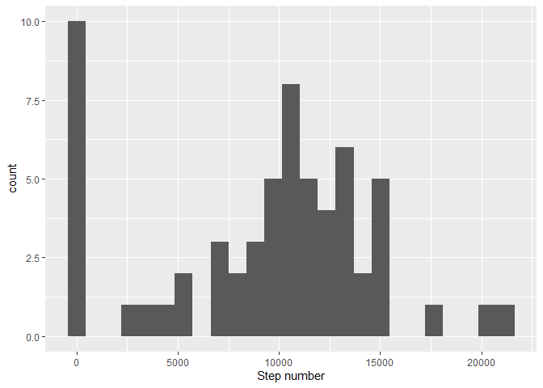
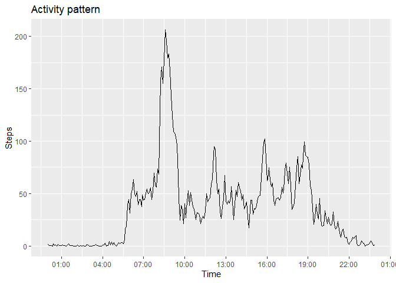
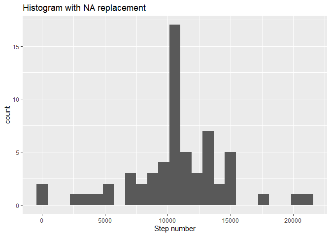
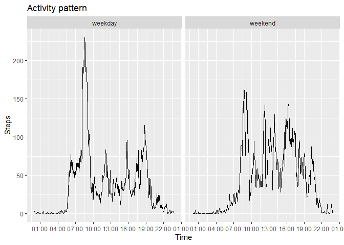

Loading necessary libraries
---------------------------

    library(lubridate)
    library(dplyr)
    library(ggplot2)

Loading and preprocessing the data
----------------------------------

    activity <- read.csv('activity.csv', stringsAsFactors = FALSE)
    activity$date <- ymd(activity$date)
    hours <- as.character(activity$interval %/% 100)
    mins <- as.character(activity$interval %% 100)
    activity$interval <-as.POSIXct(paste(hours, mins, sep = '-'), format = '%H-%M')

What is mean total number of steps taken per day?
-------------------------------------------------

    steps <- activity %>%
            group_by(date) %>%
            summarise(Number.of.steps = sum(steps, na.rm = TRUE))
    ggplot(steps, aes(Number.of.steps)) + geom_histogram(bins = 25) + labs(x = 'Step number')

    mean_steps = round(mean(steps$Number.of.steps))
    median_steps = quantile(steps$Number.of.steps, 0.5)

Mean is 9354  
Median is 10395

What is the average daily activity pattern?
-------------------------------------------

    dt_steps <- activity %>%
            group_by(interval) %>%
            summarise(Steps = mean(steps, na.rm = TRUE))
    ggplot(dt_steps, aes(x =interval, y = Steps)) +
            geom_line() +
            labs(x = 'Time', title = 'Activity pattern') +
            scale_x_datetime(date_labels = "%H:%M", date_breaks = "3 hours")

    maximum_time = dt_steps$interval[which.max(dt_steps$Steps)]

Maximum steps happens at average in 8 hours and 35 minutes

Imputing missing values
-----------------------

    na_number = sum(is.na(activity$steps))

There is 2304 missing values

Filling NAs with average interval values:

    activity2 = activity
    na_list = which(is.na(activity2$steps))
    for (i in na_list){
            na_int = activity2[i, 'interval']
            na_step = dt_steps[dt_steps$interval == na_int,'Steps']
            activity2[i,'steps'] = na_step
    }

Creating histogram

    steps2 <- activity2 %>%
            group_by(date) %>%
            summarise(Number.of.steps = sum(steps, na.rm = TRUE))
    ggplot(steps2, aes(Number.of.steps)) + geom_histogram(bins = 25) + labs(x = 'Step number', title = 'Histogram with NA replacement')

    mean_steps2 = round(mean(steps2$Number.of.steps))
    median_steps2 = quantile(steps2$Number.of.steps, 0.5)

Mean is 10766  
Median is 10766.1886792

As we can see, this two values indeed differs from the first two. Also
the values from  
filled dataset are equal. I think that this shouldn’t have happened
normally,  
but all seems correct. Filled dataset has bigger mean and median because
of the fact that NAs were counted as zeroes and, therefore, after
filling them up this values have rized.

Are there differences in activity patterns between weekdays and weekends?
-------------------------------------------------------------------------

Creating weekday/weekend factor variable

    activity2$weekday = as.factor(abs((wday(activity$date)-2) %/% 5))
    levels(activity2$weekday)<- c('weekday','weekend')

Creating panel plot

    dt_steps2 <- activity2 %>%
            group_by(weekday,interval) %>%
            summarise(Steps = mean(steps))
    ggplot(dt_steps2, aes(x =interval, y = Steps)) +
            geom_line() +
            facet_grid(.~weekday)+
            labs(x = 'Time', title = 'Activity pattern') +
            scale_x_datetime(date_labels = "%H:%M", date_breaks = "3 hours")

